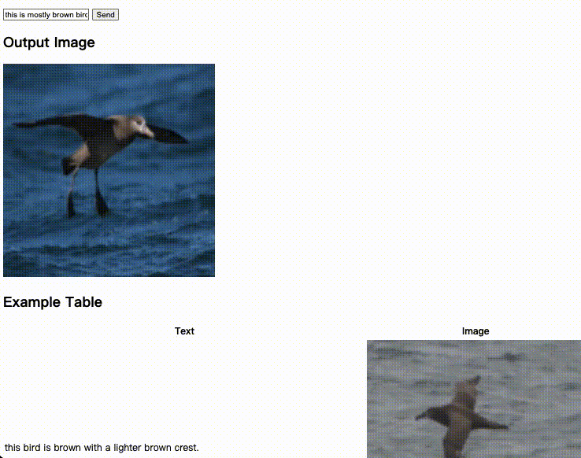
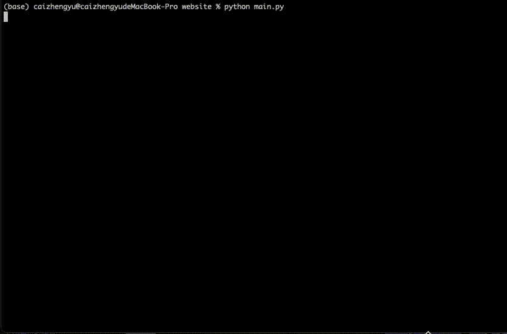
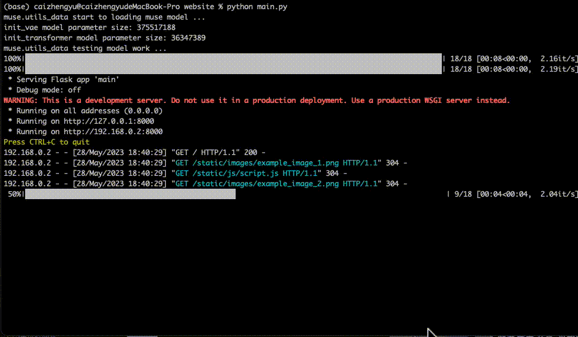

## Text-to-Image Generation
This project aims to generate an image based on an input text using an open-source implementation. The goal is to create a sample web page that takes text as input and outputs the corresponding image using a pre-trained model.

## Folder Structure
- application-test-to-image/
    - website/
    - muse/

## Solution Overview

`Model Inference`
- 1. Text Input: The user enters the desired text into the web page.
- 2. Model Inference: The input text is passed to the Muse model, which processes the text and generates an image representation based on the text.
- 3. Image Generation: The Muse model generates an image from the text representation.
- 4. Image Output: The generated image is displayed on the web page for the user to visualize and download.

`Website Interaction`
- 1. User Interface: The web page presents an input field where the user can enter the desired text.
- 2. Text Submission: Upon entering the text, the user submits the input to the server for processing.
- 3. Server-Side Processing: The server receives the submitted text and performs model inference using the Muse model. The model generates an image based on the provided text.
- 4. Image Display: Once the image is generated, it is displaye

