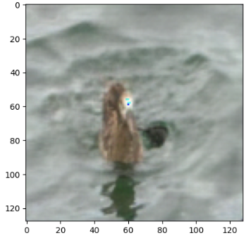

## Muse - Pytorch
Origin Repository
```bash
https://github.com/lucidrains/muse-maskgit-pytorch
```
</img>

## Implement
This is my version of Muse, an implementation of the paper "Muse: Text-to-Image Generation via Masked Generative Transformers" in PyTorch.

Please reference the pipeline at `muse/example.ipynb` for detailed implementation.


### Installation
To run the code, please ensure you have the following requirements installed:
```python
!pip3 install torch torchvision torchaudio --index-url https://download.pytorch.org/whl/cpu
!git clone https://github.com/roy860328/application-test-to-image.git
!cd application-test-to-image/muse; pip3 install -r requirements.txt
!cd application-test-to-image/muse; git clone https://github.com/Taited/clip-score.git
!pip3 install ftfy regex tqdm
!pip3 install git+https://github.com/openai/CLIP.git
```
### Dataset

The training dataset used for this version of Muse is the [Caltech-UCSD Birds-200-2011 (CUB-200) dataset](https://www.vision.caltech.edu/datasets/cub_200_2011/). It contains 11,788 images with 200 categories. The dataset provides annotations such as part locations, binary attributes, and bounding boxes for each image.

In this repo, I copy dataset directly from the below by datasets: 
https://huggingface.co/datasets/alkzar90/CC6204-Hackaton-Cub-Dataset


### Training

Follow the steps below to run the training:

```python
from muse_maskgit_pytorch import utils_data
from example import train

args = utils_data.get_args()
train.train_vae(args)
train.train_base(args)
train.inference(args)
```

### Sample Input/Output
VQGanVAE reconstruction result:

</img>

MaskGit Input:
`./dataset_text_test/*`


MaskGit Output:
`./dataset_image_test/*`

### Model Parameters
1. vae model: parameter size: 375,517,188
2. MaskGit model: parameter size: 36,347,389

### Model Evaluation

For model evaluation, I have used the CLIP score. CLIP Score refers to the cosine similarity between the feature vectors of text and images when they are inputted into OpenAI's CLIP (Contrastive Language-Image Pre-training) model. A higher CLIP Score indicates a higher correlation between the image-text pairs. CLIP Score is used to evaluate the matching and relevance between natural language and images. It provides a measure of how well the text and image are aligned and correlated.


The following command is for the original dataset of image-text pairs:

```python
import evaluation_data
evaluation_data.save_origin_dataset()
```

Run the CLIP score evaluation on the original dataset:

```python
python3 src/clip_score/clip_score.py ./dataset_image_origin ./dataset_text_origin
```

The following command loads a pre-trained model to generate an image from text:

```python
import evaluation_data
import utils_model
gt_texts = ['this bird is brown with a lighter brown crest.']
images = utils_model.inference(gt_texts)
evaluation_data.save_image_text(images,
                                gt_texts,
                                path_name_image="dataset_image_test",
                                path_name_text="dataset_text_test")
```

Run the CLIP score evaluation on the result:

```python
python3 src/clip_score/clip_score.py ./dataset_image_test ./dataset_text_test
```

